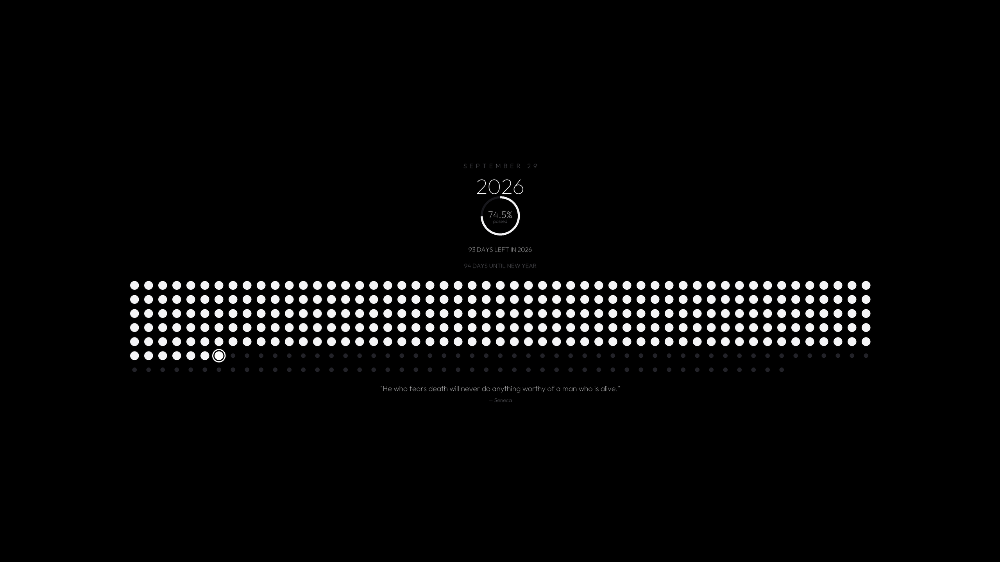

# ⏳ Year Progress Wallpaper

A minimalist, high-definition desktop wallpaper generator and daily tracker for **Windows, macOS and Linux**. Inspired by the Stoic *Memento Mori* concept and modern minimalist dashboards.



---

## 🖥 Platform Support

| | Windows | macOS | Linux |
|---|---|---|---|
| Generate & apply wallpaper | ✅ Registry + `SystemParametersInfo` | ✅ `NSWorkspace` (pyobjc), `osascript` fallback | ✅ gsettings (GNOME/Cinnamon/MATE), plasma (KDE), xfconf (Xfce), feh/sway fallbacks |
| Per-monitor wallpaper | ✅ `IDesktopWallpaper` (one render per display) | ✅ per-screen `NSWorkspace` | — (desktops apply one image across all outputs) |
| Login/startup integration | ✅ HKCU Run key | ✅ Launch Agent | ✅ XDG autostart entry |
| System tray | ✅ | ✅ | ✅ (AppIndicator/GTK backend required) |
| Control panel UI | ✅ pywebview (WebView2) + Tk fallback | ✅ pywebview (WKWebView) | ✅ pywebview (WebKitGTK) + Tk fallback |
| Lock screen control | ✅ | — (Windows-only, hidden in UI) | — (Windows-only, hidden in UI) |
| Data directory | `%LOCALAPPDATA%\YearProgressWallpaper` | `~/Library/Application Support/YearProgressWallpaper` | `$XDG_DATA_HOME/YearProgressWallpaper` (default `~/.local/share/...`) |

**Linux system packages** (Debian/Ubuntu names; needed at runtime):
```bash
sudo apt install python3-gi gir1.2-appindicator3-0.1 gir1.2-webkit2-4.1
# Tray fallback if AppIndicator is unavailable:
pip install python-xlib
```

**macOS notes**: the first wallpaper apply may prompt for automation permission (osascript fallback only — the primary `NSWorkspace` path needs none). Unsigned builds require right-click → *Open* on first launch (Gatekeeper); signing/notarization is configured at build time when an Apple Developer ID is available.

---

## ✨ Features

- **Modern Fluent Dark UI**: Built with CustomTkinter featuring clean cards, high-DPI scaling, and live real-time desktop preview.
- **Dot Grid Calendar**: Displays all 365 (or 366 in leap years) days of the current year.
  - **Passed Days**: Rendered as larger, customizable dots (`⚪`).
  - **Today**: Highlighted with an accent focus ring (`🔘`) marking your exact place in time.
  - **Remaining Days**: Displayed as smaller, muted dots (`⚫`).
- **🔍 Dot Grid Zoom Control**:
  - Interactive zoom slider from **50% to 200%**.
  - Zoom in for bold, prominent dots, or zoom out for ultra-fine minimalist spacing.
  - One-click `Reset Default (100%)` button.
- **🎨 Full Color Customization**:
  - **1-Click Theme Presets**: 18 curated palettes, including *Monochrome Noir* (default), *Pure Black OLED* (pitch black `#000000`), *Cyber Midnight*, *Emerald Zen*, *Golden Hour*, *Solar Crimson*, *Royal Amethyst*, *Nordic Frost*, *Matcha*, *Terracotta*, *Ocean Abyss*, *Sepia*, *Tokyo Rain*, *Rose Quartz*, *Titanium*, *Nord*, *Solarized Dark*, and *Cyberpunk*.
  - **Custom Color Pickers**: Full control over background, passed dots, today's dot/ring, coming dots, and typography colors with HEX entries and visual color dialogs.
- **💬 Motivational & Stoic Quotes**:
  - **Curated Catalog**: 40 handpicked timeless quotes (Marcus Aurelius, Seneca, Epictetus, Steve Jobs, Confucius, Mark Twain, etc.).
  - **Custom Quote**: Type any custom quote and author to display on your desktop.
  - **Daily Random Quote**: Automatically rotates to an inspiring new quote every day at midnight.
  - **Quick Shuffle**: Single-click `Shuffle Random` button.
- **Multiple Layout Modes**:
  - `Reference (10 Columns)`: Faithful reproduction of the mobile reference screenshot, centered as an elegant pillar.
  - `Balanced (20 Columns)`: Optimized for 16:9 and 16:10 widescreen desktop displays (20 × 19).
  - `Wide Matrix (25 Columns)`: Sleek compact widescreen grid (25 × 15).
  - `Calendar (53 Columns)`: GitHub contribution matrix style (53 weeks × 7 days).
- **⚡ Automated Daily Updates**:
  - Automatically regenerates and applies the wallpaper every night at **12:00:00 AM (Midnight)**.
  - Integrated sleep/wake detector: If your PC sleeps through midnight, the wallpaper updates within seconds of waking up in the morning.
- **🚀 Startup Integration**:
  - Windows: registered in `HKCU\Software\Microsoft\Windows\CurrentVersion\Run`.
  - macOS: installed as a Launch Agent in `~/Library/LaunchAgents`.
  - Linux: installed as an XDG autostart entry in `~/.config/autostart`.
  - Runs silently in the system tray without annoying popups on login.
- **Native Resolution & Anti-Aliased Rendering**:
  - Auto-detects physical screen resolution (1080p, 1440p, 4K, Ultrawide).
  - 2× supersampling with Lanczos downsampling ensures crisp typography and smooth circles.
- **🖥 Multi-Monitor Support**:
  - Renders one correctly-sized image per connected display (Windows/macOS) and applies them individually through `IDesktopWallpaper` / per-screen `NSWorkspace`.
  - Falls back to a single image on every display automatically when the per-monitor API is unavailable; toggleable in the System tab (`multi_monitor`).
- **🔔 Update Checker**:
  - Checks GitHub Releases once a day at launch and notifies through the system tray when a newer version exists (opt-out via `check_updates`; manual *Check now* button in the System tab).
- **System Tray Quick Access**:
  - Right-click or click tray icon to update wallpaper immediately, skip to the next quote, open the dashboard, or toggle startup.

---

## 🚀 How to Run

### Option 1: Standalone Executable
- Windows: double-click `YearProgress.exe`
- macOS: open `YearProgress.app`
- Linux: `./YearProgress`

### Option 2: Batch Launcher (Windows only)
Double-click:
```
run.bat
```

### Option 3: Python
```powershell
python main.py
```

---

## 📦 Building Releases

PyInstaller cannot cross-compile — build natively on each target OS:

```powershell
# Windows
pip install -r requirements-dev.txt
pyinstaller --noconfirm YearProgress.spec   # → dist\YearProgress.exe
```

```bash
# macOS  → dist/YearProgress.app
pip install -r requirements-dev.txt
pyinstaller --noconfirm YearProgress.spec

# Linux  → dist/YearProgress  (build on the oldest glibc you support,
# e.g. an Ubuntu 22.04 container, for maximum compatibility)
pip install -r requirements-dev.txt
pyinstaller --noconfirm YearProgress.spec
```

Before building, run the lint gate that must stay green:
```powershell
ruff check .
```

---

## 🛠 Command Line Options

- `python main.py` : Launches the full modern Control Panel and starts the background tray + midnight scheduler.
- `python main.py --minimized` : Starts directly in the system tray (used by login startup).
- `python main.py --startup` : Same as `--minimized`; marks an OS startup launch.
- `python main.py --update-now` : Generates and sets today's wallpaper immediately and exits.
- `python main.py --lockscreen IMAGE` : Sets the Windows lock screen to `IMAGE` (runs elevated; internal use, invoked by the UI).
- `python main.py --lockscreen-clear` : Restores the default Windows lock screen (runs elevated; internal use).

---

## ⚙️ Configuration & Data Files

- **Data Directory:** see the table in [Platform Support](#-platform-support) (Windows: `%LOCALAPPDATA%\YearProgressWallpaper`, macOS: `~/Library/Application Support/YearProgressWallpaper`, Linux: `$XDG_DATA_HOME/YearProgressWallpaper`).
  - All user data and generated wallpapers are stored here so they persist reliably across reboots (including when running the packaged executable).
  - `settings.json`: All user preferences (zoom level, custom colors, layout style, quote choice, auto-update toggle, multi-monitor toggle, update-check toggle, last rendered date).
  - `quotes.json`: Editable database of motivational quotes (auto-seeded from the bundled catalog on first run; edit this copy to customize).
  - `wallpaper_YYYY-MM-DD.bmp` / `.png`: Today's generated desktop wallpaper (the `.png` is what gets applied on every OS; older days are cleaned up automatically). Multi-monitor runs add `wallpaper_YYYY-MM-DD_dN.*` siblings sized for each secondary display.
  - `preview_thumbnail.png`: The live preview image shown in the control panel.
- **Bundled resources** (read-only, shipped inside the executable or alongside the source): `web/` (webview UI), `assets/fonts/` (typography), `app_icon.png` / `app_icon.ico`.
